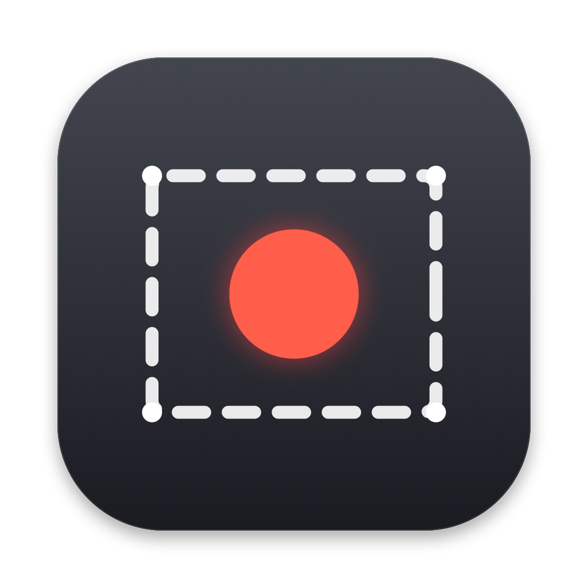
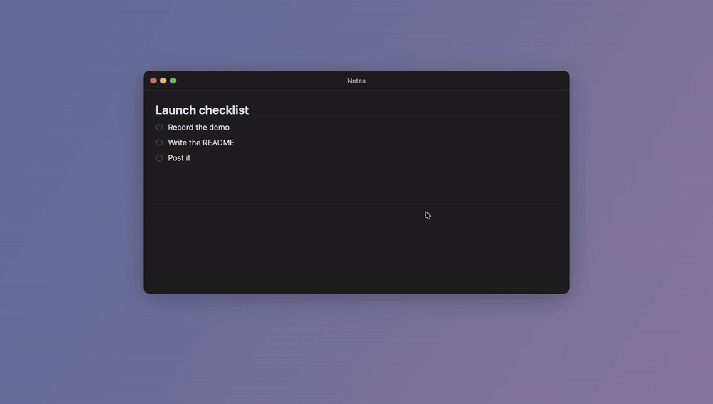
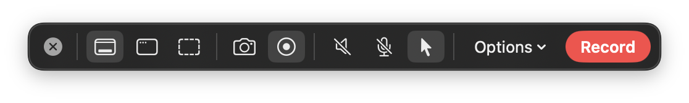
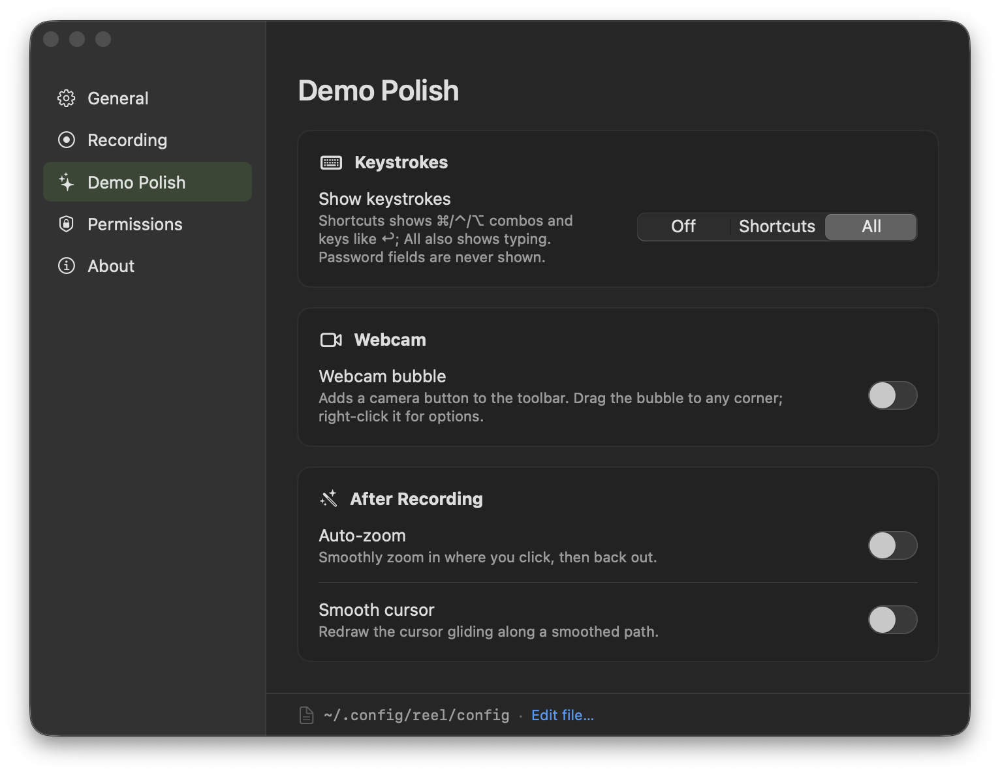

<p align="center">
  
</p>

<h1 align="center">reel</h1>

<p align="center">An open-source screen recorder for macOS.</p>

<p align="center">
  <a href="https://github.com/riensou/reel/actions/workflows/ci.yml"></a>
  
  <a href="LICENSE"></a>
</p>

<p align="center">
  
  <br>
  <sub>Recorded with reel, with auto-zoom and smooth cursor on.</sub>
</p>

reel lives in the menu bar and works like macOS's built-in screenshot tool (⌘⇧5):
- Pick a screen, window or region, then take a screenshot or record a video.
- A thumbnail appears in the corner, and the file is saved to your screenshots folder.

On top of that, it adds a few things the built-in tool doesn't have:
- System audio and microphone recording, with a live level meter so you can check them before you start.
- MP4 output, with mic and system audio mixed into one track.
- Pause and resume, trimming, and GIF export.
- A plain-text config file, plus a settings window that edits it.
- Optional extras for demo videos: a countdown, keystroke display, webcam bubble, zoom-on-click and a smoothed cursor.

<p align="center">
  
</p>

## Install

reel needs macOS 15 or later on Apple silicon.

1. Download `reel-x.y.z.zip` from the [latest release](https://github.com/riensou/reel/releases/latest), unzip it, and move **reel.app** into Applications.
2. Open it. reel isn't notarized by Apple (that needs a paid developer account), so the first time macOS will say it can't verify the app. Go to **System Settings → Privacy & Security**, scroll down, and click **Open Anyway**.
   - Or, from Terminal: `xattr -dr com.apple.quarantine /Applications/reel.app`
3. A welcome window shows the shortcut and asks for **Screen & System Audio Recording** permission.

Microphone, Camera and Accessibility permissions are only requested if you turn on a feature that needs them (Accessibility is for the keystroke display).

<details>
<summary>Build from source</summary>

Requires Xcode 16 or later.

```sh
git clone https://github.com/riensou/reel.git
cd reel
scripts/make-dev-cert.sh   # once: a local signing identity so macOS remembers reel's permissions
scripts/install.sh         # builds reel.app into /Applications and opens it
```
</details>

## Usage

| | |
|---|---|
| **⌘⇧6** | Open the toolbar. During a recording, stop it. (Changeable in Settings.) |
| **Toolbar** | Screen / Window / Region · Screenshot / Record · system audio · mic · cursor · Options |
| **Region** | Like ⌘⇧5, your last selection appears with the toolbar. Drag inside it to move it, drag the handles to resize, or drag elsewhere for a new one. ↩ or the Capture button captures, Esc cancels. |
| **Menu bar timer** | Click to stop the recording. Right-click to pause, resume or cancel. |
| **Thumbnail** | Click to open, drag into another app, swipe to dismiss. Right-click to trim, export a GIF, convert between MP4 and MOV, copy or delete. |

Everything else is in the menu bar menu or under **Settings…**.

### Demo extras

All of these are off by default. Turn them on under **Settings → Demo Polish**.

- **Countdown:** 3-2-1 before recording starts.
- **Recording border:** outlines the recorded area on screen. The outline isn't in the video.
- **Keystrokes:** shows shortcuts (or everything you type) at the bottom of the recording. Password fields are never shown.
- **Webcam bubble:** a draggable camera overlay that snaps to the corners.
- **Auto-zoom:** after recording, zooms in where you clicked and follows the cursor.
- **Smooth cursor:** after recording, redraws the cursor along a smoothed path, with a small ripple on each click.

Auto-zoom and smooth cursor re-encode the video when you stop recording. reel only re-encodes frames where something changed, so a typical recording takes about a quarter of its length to process. The thumbnail shows progress while that runs.

<p align="center">
  
</p>

## Configuration

Settings are stored in `~/.config/reel/config` (or `$XDG_CONFIG_HOME/reel/config`). reel creates the file the first time it runs, with every option listed and commented out. It reloads the file when you save it. The settings window edits the same file and leaves your comments in place. If a line is invalid, reel shows a notice with the line number.

```ini
save-directory = system          # system (follows macOS) | ~/some/folder
video-format = mp4               # mp4 | mov
video-codec = auto               # auto (H.264, or HEVC above 4K) | h264 | hevc
fps = 60
merge-audio-tracks = true
thumbnail = true
thumbnail-duration = 5
hotkey = cmd+shift+6
launch-at-login = false
check-for-updates = true
countdown = 0                    # seconds, 0 = off
recording-border = false
show-keystrokes = off            # off | shortcuts | all
webcam = false
webcam-size = medium             # small | medium | large
webcam-shape = circle            # circle | rounded
auto-zoom = false
auto-zoom-scale = 1.8
smooth-cursor = false
```

reel also remembers a few things between sessions, separately from the config file: your last mode, the toolbar toggles and your last region on each display.

## Command line

The app binary can also capture without any UI:

```sh
/Applications/reel.app/Contents/MacOS/reel --shot out.png
/Applications/reel.app/Contents/MacOS/reel --record 10 out.mp4 --system-audio --mic
```

## Privacy

reel doesn't collect anything, and recordings never leave your Mac. It makes two kinds of network requests, both anonymous and both to GitHub's public API:

- **Update check:** once a day, reel asks for the latest release. Turn this off in Settings, or with `check-for-updates = false`.
- **Star count:** fetched when you open Settings → About.

## How it works

- **Capture:** reel is written in Swift and uses ScreenCaptureKit, which records video, system audio and microphone together. Pausing ends the current file; resuming starts a new one on the same capture stream.
- **Finishing:** when you stop, the pieces are joined and the audio is mixed into a single AAC track. The video is copied without re-encoding unless auto-zoom or the smooth cursor is on.
- **Auto-zoom:** clicks that are close together in time and position form a group. The camera moves to each group, follows the cursor while you're inside it, and zooms back out afterwards.
- **Smooth cursor:** the cursor path is run through a critically damped spring, which removes jitter without overshooting. The cursor still lands exactly where each click happened.

The code is split into two parts:
- `Sources/ReelCore`: capture, finishing, config and effects, with no UI. Covered by `swift test`.
- `Sources/reel`: the menu bar app (toolbar, overlays, thumbnail, settings).

## Contributing

Bug reports and pull requests are welcome. For development:

```sh
swift test        # unit tests
scripts/run.sh    # build a debug copy into build.noindex/ and launch it

# Debug builds also have an end-to-end check of the interactive flows
# (region picker, countdown, border, pause, cancel, recovery, trim):
build.noindex/reel.app/Contents/MacOS/reel --self-test /tmp/reel-selftest
```

## License

[MIT](LICENSE)
